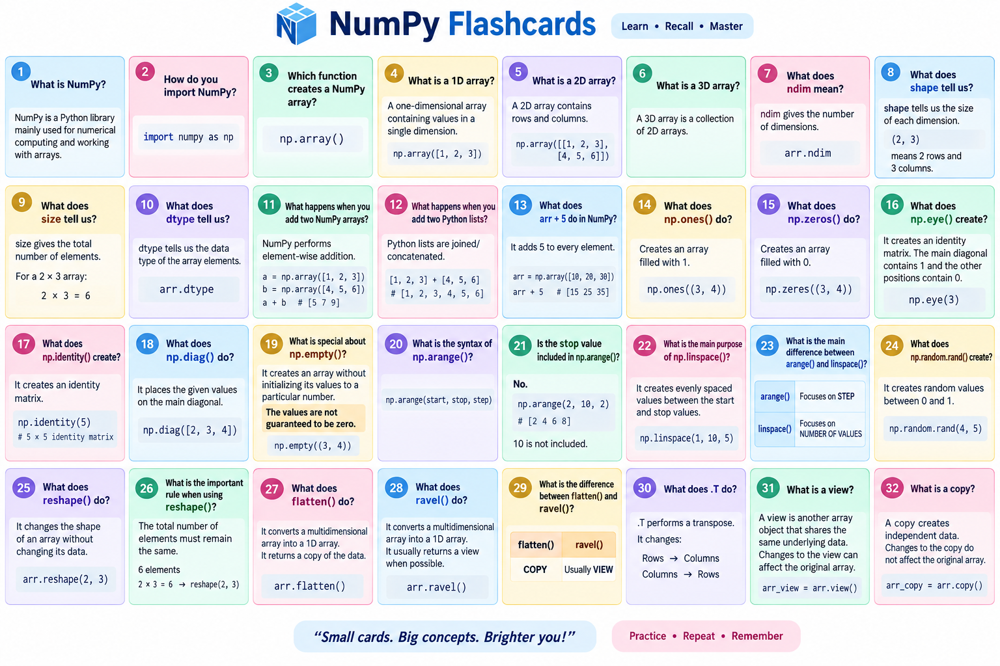
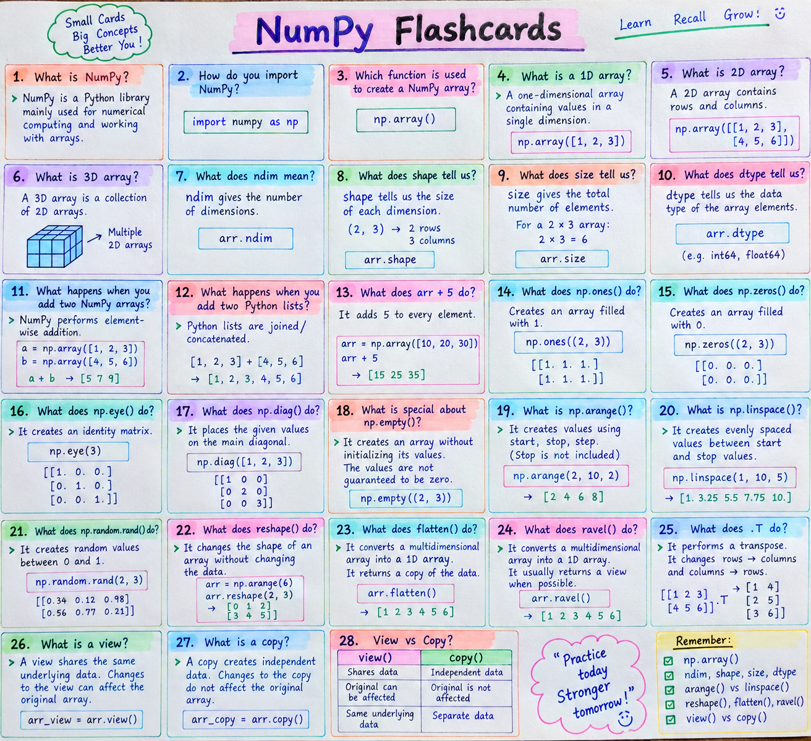

# 🔢 NumPy – Beginner Friendly README

> 🚀 **NumPy (Numerical Python)** is one of the most important Python libraries for **Data Science, Machine Learning, Scientific Computing, and Data Analysis**.

---

## 📚 Table of Contents

* [1. What is NumPy?](#1-what-is-numpy)
* [2. Why do we use NumPy?](#2-why-do-we-use-numpy)
* [3. Python List vs NumPy Array](#3-python-list-vs-numpy-array)
* [4. Creating a NumPy Array](#4-creating-a-numpy-array)
* [5. Dimensions](#5-dimensions)
* [6. Array Attributes](#6-array-attributes)
* [7. Element-wise Operations](#7-element-wise-operations)
* [8. dtype](#8-dtype)
* [9. Ones and Zeros](#9-ones-and-zeros)
* [10. Identity Matrix](#10-identity-matrix)
* [11. Diagonal Matrix](#11-diagonal-matrix)
* [12. Empty Array](#12-empty-array)
* [13. arange()](#13-arange)
* [14. linspace()](#14-linspace)
* [15. Random Arrays](#15-random-arrays)
* [16. Reshape](#16-reshape)
* [17. Flatten](#17-flatten)
* [18. Ravel](#18-ravel)
* [19. Transpose](#19-transpose)
* [20. View vs Copy](#20-view-vs-copy)
* [21. Performance](#21-performance)
* [22. Summary](#22-summary)
* [23. Interview Questions](#23-interview-questions)

---

# 🧠 1. What is NumPy?

### 📌 Definition

**NumPy** stands for **Numerical Python**.

It is a Python library used for:

* 🔢 Numerical calculations
* 📊 Working with arrays
* 🧮 Mathematical operations
* 📐 Multidimensional data
* 🤖 Machine Learning
* 📈 Data Science
* 🔬 Scientific Computing

NumPy mainly provides a powerful data structure called an **ndarray**.

### 💡 Simple Explanation

Think of a NumPy array as a **fast mathematical container**.

```python
import numpy as np

arr = np.array([10, 20, 30, 40])

print(arr)
```

Output:

```text
[10 20 30 40]
```

---

# 🚀 2. Why do we use NumPy?

Python lists are useful, but NumPy arrays are designed for numerical computation.

### ⭐ Main advantages

| Feature                 | Python List         | NumPy Array  |
| ----------------------- | ------------------- | ------------ |
| Numerical operations    | ⚠️ Limited          | ✅ Excellent  |
| Speed                   | 🐢 Slower           | 🚀 Faster    |
| Multidimensional data   | ⚠️ Difficult        | ✅ Easy       |
| Element-wise operations | ❌ No direct support | ✅ Supported  |
| Data type               | Mixed               | Usually same |
| Large numerical data    | ⚠️ Less efficient   | ✅ Efficient  |

NumPy arrays support element-wise operations and are efficient for large numerical datasets.

---

# ⚔️ 3. Python List vs NumPy Array

## 🐍 Python List

```python
list_1 = [1, 2, 3]
list_2 = [4, 5, 6]

print(list_1 + list_2)
```

Output:

```text
[1, 2, 3, 4, 5, 6]
```

Here `+` performs **concatenation**.

---

## 🔢 NumPy Array

```python
import numpy as np

a = np.array([1, 2, 3])
b = np.array([4, 5, 6])

print(a + b)
```

Output:

```text
[5 7 9]
```

Here NumPy performs **element-wise addition**.

### 🧠 Remember

```text
List + List
      ↓
Concatenation

Array + Array
      ↓
Element-wise addition
```

---

# 🛠️ 4. Creating a NumPy Array

## 📌 Syntax

```python
np.array(data)
```

## 💻 Example

```python
import numpy as np

arr = np.array([3, 4, 5])

print(arr)
```

Output:

```text
[3 4 5]
```

You can also convert an existing Python list:

```python
numbers = [10, 20, 30, 40]

arr = np.array(numbers)

print(arr)
```

---

# 📐 5. Dimensions

NumPy supports multidimensional arrays.

## 1️⃣ 1D Array

```python
arr = np.array([1, 2, 3, 4])
```

Visualization:

```text
[1 2 3 4]
```

---

## 2️⃣ 2D Array

```python
arr = np.array([
    [1, 2, 3],
    [4, 5, 6]
])
```

Visualization:

```text
1  2  3
4  5  6
```

Check dimensions:

```python
print(arr.ndim)
```

Output:

```text
2
```

---

## 3️⃣ 3D Array

```python
arr = np.array([
    [
        [1, 2],
        [3, 4]
    ],
    [
        [5, 6],
        [7, 8]
    ]
])

print(arr.ndim)
```

Output:

```text
3
```

### 🧠 Remember

```text
1D → Vector
2D → Matrix
3D → Collection of matrices
```

Your notes also demonstrate creating 5D arrays using nested lists.

---

# 📊 6. Array Attributes

NumPy arrays have important attributes.

```python
import numpy as np

arr = np.array([
    [1, 2, 3],
    [4, 5, 6]
])

print(arr.ndim)
print(arr.shape)
print(arr.size)
print(arr.dtype)
```

### 🔑 Important attributes

| Attribute | Meaning                  |
| --------- | ------------------------ |
| `ndim`    | Number of dimensions     |
| `shape`   | Size of each dimension   |
| `size`    | Total number of elements |
| `dtype`   | Data type                |

Example:

```text
ndim  → 2
shape → (2, 3)
size  → 6
dtype → int64
```

These are among the most important NumPy attributes to remember for interviews.

---

# ➕ 7. Element-wise Operations

NumPy allows mathematical operations directly on arrays.

```python
import numpy as np

a = np.array([3, 4, 5])
b = np.array([6, 7, 8])

print(a + b)
print(a - b)
print(a * b)
print(a / b)
```

Output conceptually:

```text
Addition:
[ 9 11 13 ]

Subtraction:
[-3 -3 -3]

Multiplication:
[18 28 40]

Division:
[0.5        0.57142857 0.625     ]
```

---

## ➕ Adding a single number

```python
arr = np.array([10, 20, 30, 40])

print(arr + 5)
```

Output:

```text
[15 25 35 45]
```

NumPy applies the operation to every element.

---

# 🔤 8. dtype

`dtype` tells us the **data type of elements inside the NumPy array**.

## 📌 Syntax

```python
np.array(data, dtype="datatype")
```

## 💻 Example

```python
import numpy as np

arr = np.array(
    [45, 67, 899874564675, 23],
    dtype="int64"
)

print(arr.dtype)
```

Output:

```text
int64
```

---

## 🧠 NumPy is Usually Homogeneous

This means elements generally have the **same data type**.

Example:

```python
arr = np.array([34, 56, 78, 23, 45.7])

print(arr)
print(arr.dtype)
```

Because `45.7` is a float, NumPy converts the integers to a compatible numeric type.

Conceptually:

```text
34
56
78
23
45.7
 ↓
float
```

Your notes specifically demonstrate this automatic conversion.

---

# ⬜ 9. Ones and Zeros

## `np.ones()`

Creates an array filled with `1`.

### Syntax

```python
np.ones(shape)
```

### Example

```python
import numpy as np

arr = np.ones((3, 4))

print(arr)
```

---

## `np.zeros()`

Creates an array filled with `0`.

### Syntax

```python
np.zeros(shape)
```

### Example

```python
arr = np.zeros((2, 3))

print(arr)
```

Your notes use `np.ones((3, 4))` and `np.zeros((2, 3))`.

---

# 🟦 10. Identity Matrix

An identity matrix has:

```text
1 0 0
0 1 0
0 0 1
```

## `np.eye()`

```python
import numpy as np

arr = np.eye(4)

print(arr)
```

---

## `np.identity()`

```python
arr = np.identity(5)

print(arr)
```

Both are used to create identity matrices in the examples from your notes.

---

# 🔲 11. Diagonal Matrix

Use `np.diag()`.

### Syntax

```python
np.diag(values)
```

### Example

```python
import numpy as np

arr = np.diag([2, 3, 4, 5, 6])

print(arr)
```

Result:

```text
2 0 0 0 0
0 3 0 0 0
0 0 4 0 0
0 0 0 5 0
0 0 0 0 6
```

---

# ⚪ 12. Empty Array

`np.empty()` creates an array **without initializing its values to zero**.

### Syntax

```python
np.empty(shape)
```

### Example

```python
import numpy as np

arr = np.empty((2, 4))

print(arr)
```

⚠️ The values should **not be assumed to be zero**.

---

# 🔢 13. `arange()`

`np.arange()` generates values over a range.

## 📌 Syntax

```python
np.arange(start, stop, step)
```

### Example

```python
import numpy as np

arr = np.arange(2, 10, 2)

print(arr)
```

Output:

```text
[2 4 6 8]
```

### ⚠️ Important

The `stop` value is **excluded**.

```python
np.arange(2, 10, 2)
```

means:

```text
Start = 2
Stop  = 10
Step  = 2

Result → 2 4 6 8
```

---

## 🔄 Reverse `arange()`

```python
arr = np.arange(100, 10, -2)

print(arr)
```

When `start > stop`, use a negative step.

---

# 📏 14. `linspace()`

`np.linspace()` generates a specified number of **equally spaced values**.

### 📌 Syntax

```python
np.linspace(start, stop, number_of_values)
```

### 💻 Example

```python
import numpy as np

arr = np.linspace(1, 10, 9)

print(arr)
```

### 🧠 Difference

```text
arange()
   ↓
Uses step

linspace()
   ↓
Uses number of values
```

---

# 🎲 15. Random Arrays

## `np.random.rand()`

Generates random values.

```python
import numpy as np

arr = np.random.rand(4, 5)

print(arr)
```

This creates a `4 × 5` random array.

---

## 🎯 `np.random.randint()`

Generates random integers.

### Syntax

```python
np.random.randint(start, stop, size)
```

### Example

```python
arr = np.random.randint(2, 10, 5)

print(arr)
```

It generates 5 random integers from `2` through `9`; the stop value is excluded.

---

## 📊 `np.random.randn()`

Generates values from a standard normal distribution.

```python
arr = np.random.randn(5)

print(arr)
```

Standard normal distribution:

```text
Mean = 0
Standard Deviation = 1
```

---

# 🔄 16. Reshape

`reshape()` changes the shape of an array without changing its elements.

### 📌 Syntax

```python
array.reshape(rows, columns)
```

### 💻 Example

```python
import numpy as np

arr = np.arange(1, 7)

print(arr)

reshaped_arr = arr.reshape(2, 3)

print(reshaped_arr)
```

Output:

```text
Original:
[1 2 3 4 5 6]

Reshaped:
[[1 2 3]
 [4 5 6]]
```

### 🧠 Important

Number of elements must remain the same.

```text
Original → 6 elements

2 × 3 → 6 elements ✅

3 × 3 → 9 elements ❌
```

---

# 📦 17. Flatten

`flatten()` converts a multidimensional array into a 1D array.

```python
import numpy as np

arr = np.array([
    [1, 2, 3],
    [4, 5, 6]
])

flattened = arr.flatten()

print(flattened)
```

Output:

```text
[1 2 3 4 5 6]
```

---

# 🧵 18. Ravel

`ravel()` also converts an array into a 1D representation.

```python
import numpy as np

arr = np.array([
    [1, 2, 3],
    [4, 5, 6]
])

raveled = arr.ravel()

print(raveled)
```

Output:

```text
[1 2 3 4 5 6]
```

### 🧠 Beginner Tip

Remember:

```text
flatten()
   ↓
1D array

ravel()
   ↓
1D representation
```

---

# 🔃 19. Transpose

Transpose changes rows into columns and columns into rows.

### Syntax

```python
array.T
```

### Example

```python
import numpy as np

arr = np.array([
    [1, 2, 3],
    [4, 5, 6]
])

print(arr.T)
```

Output:

```text
[[1 4]
 [2 5]
 [3 6]]
```

### 🧠 Remember

```text
Original:

1 2 3
4 5 6

Transpose:

1 4
2 5
3 6
```

---

# 👀 20. View vs Copy

NumPy provides `view()` and `copy()`.

```python
import numpy as np

arr = np.array([1, 2, 3])

arr_view = arr.view()

arr_copy = arr.copy()
```

### 👀 View

```python
arr_view = arr.view()
```

A view can share the same underlying data.

### 📦 Copy

```python
arr_copy = arr.copy()
```

A copy creates an independent copy of the data.

Your notes introduce `view()` as view-like behavior and `copy()` as a deep copy.

### 🧠 Easy Memory Trick

```text
VIEW
 ↓
Look at same data

COPY
 ↓
Create separate data
```

---

# ⚡ 21. Performance

NumPy is designed to perform numerical operations efficiently.

Your notes compare calculating squares for **10 million values** using:

```python
result_list = [i ** 2 for i in python_list]
```

versus:

```python
result_array = numpy_array ** 2
```

The example measures execution time and reports which approach was faster for that particular run.

### 🚀 Main idea

```text
Large Numerical Data
        ↓
     NumPy
        ↓
Efficient Operations
```

---

# 📝 22. Summary

## ⭐ NumPy Cheat Sheet

| Concept             | Syntax                |
| ------------------- | --------------------- |
| Import              | `import numpy as np`  |
| Create array        | `np.array()`          |
| Dimensions          | `.ndim`               |
| Shape               | `.shape`              |
| Total elements      | `.size`               |
| Data type           | `.dtype`              |
| Ones                | `np.ones()`           |
| Zeros               | `np.zeros()`          |
| Identity            | `np.eye()`            |
| Identity            | `np.identity()`       |
| Diagonal            | `np.diag()`           |
| Empty               | `np.empty()`          |
| Range               | `np.arange()`         |
| Equal spacing       | `np.linspace()`       |
| Random values       | `np.random.rand()`    |
| Random integers     | `np.random.randint()` |
| Normal distribution | `np.random.randn()`   |
| Reshape             | `.reshape()`          |
| Flatten             | `.flatten()`          |
| Ravel               | `.ravel()`            |
| Transpose           | `.T`                  |
| View                | `.view()`             |
| Copy                | `.copy()`             |

---

# 🎯 23. Interview Questions & Answers

## ❓ Q1. What is NumPy?

### ✅ Answer

NumPy is a Python library used for numerical computing. It provides multidimensional arrays and efficient operations for working with numerical data.

---

## ❓ Q2. What is an ndarray?

### ✅ Answer

`ndarray` is NumPy's main array data structure. It represents a multidimensional array.

Example:

```python
arr = np.array([1, 2, 3])
```

---

## ❓ Q3. What is the difference between a Python list and NumPy array?

### ✅ Answer

Python lists can contain different data types and support dynamic resizing. NumPy arrays are generally homogeneous, support efficient element-wise numerical operations, and are designed for efficient numerical computation.

---

## ❓ Q4. What does `ndim` mean?

### ✅ Answer

`ndim` returns the number of dimensions of a NumPy array.

```python
arr = np.array([
    [1, 2],
    [3, 4]
])

print(arr.ndim)
```

Output:

```text
2
```

---

## ❓ Q5. What does `shape` mean?

### ✅ Answer

`shape` tells us the size of the array along each dimension.

```python
arr = np.array([
    [1, 2, 3],
    [4, 5, 6]
])

print(arr.shape)
```

Output:

```text
(2, 3)
```

Meaning:

```text
2 rows
3 columns
```

---

## ❓ Q6. What is `dtype`?

### ✅ Answer

`dtype` tells us the data type of the elements in a NumPy array.

```python
arr = np.array([1, 2, 3])

print(arr.dtype)
```

---

## ❓ Q7. What is element-wise operation?

### ✅ Answer

An element-wise operation applies the operation to corresponding elements.

```python
a = np.array([1, 2, 3])
b = np.array([4, 5, 6])

print(a + b)
```

Output:

```text
[5 7 9]
```

---

## ❓ Q8. What is the difference between `arange()` and `linspace()`?

### ✅ Answer

`arange()` generates values based on a **step size**, while `linspace()` generates a specified **number of equally spaced values**.

```python
np.arange(1, 10, 2)
```

uses a step.

```python
np.linspace(1, 10, 5)
```

uses the number of values.

---

## ❓ Q9. What is `reshape()`?

### ✅ Answer

`reshape()` changes the shape of an array while keeping the same number of elements.

```python
arr = np.arange(1, 7)

print(arr.reshape(2, 3))
```

---

## ❓ Q10. What is `flatten()`?

### ✅ Answer

`flatten()` converts a multidimensional array into a one-dimensional array.

```python
arr.flatten()
```

---

## ❓ Q11. What is transpose?

### ✅ Answer

Transpose changes rows into columns and columns into rows.

```python
arr.T
```

---

## ❓ Q12. What is the difference between `view()` and `copy()`?

### ✅ Answer

A view can share the underlying data with the original array, while a copy creates independent data.

```python
view = arr.view()

copy = arr.copy()
```

---

## ❓ Q13. Why is NumPy important in Data Science?

### ✅ Answer

NumPy provides efficient numerical arrays and mathematical operations. It is widely used as a foundation for Data Science, Machine Learning, and scientific computing.

---

## ❓ Q14. What does `np.zeros()` do?

### ✅ Answer

It creates an array filled with zeros.

```python
np.zeros((2, 3))
```

---

## ❓ Q15. What does `np.ones()` do?

### ✅ Answer

It creates an array filled with ones.

```python
np.ones((3, 4))
```

---

# 🧠 🔥 Interview Memory Map

```text
                    NUMPY
                      │
       ┌──────────────┼──────────────┐
       ↓              ↓              ↓
     Array        Operations      Attributes
       │              │              │
       ↓              ↓              ↓
   np.array()      + - * /         ndim
   1D / 2D / 3D                    shape
                                   size
                                   dtype
       
       ┌──────────────┼──────────────┐
       ↓              ↓              ↓
   Creation       Reshaping       Random
       │              │              │
 ones()           reshape()       rand()
 zeros()          flatten()       randint()
 arange()         ravel()         randn()
 linspace()       .T
```

---

# 🏆 Beginner Learning Order

Learn NumPy in this order:

```text
1️⃣ What is NumPy?
        ↓
2️⃣ Python List vs NumPy Array
        ↓
3️⃣ np.array()
        ↓
4️⃣ 1D / 2D / 3D Arrays
        ↓
5️⃣ ndim / shape / size / dtype
        ↓
6️⃣ Element-wise Operations
        ↓
7️⃣ zeros() / ones()
        ↓
8️⃣ arange() / linspace()
        ↓
9️⃣ Random Arrays
        ↓
🔟 reshape()
        ↓
1️⃣1️⃣ flatten() / ravel()
        ↓
1️⃣2️⃣ transpose
        ↓
1️⃣3️⃣ view() / copy()
        ↓
1️⃣4️⃣ Performance
```

---

# 🎓 Final Beginner Summary

### 🔢 NumPy = Numerical Python

Remember these **10 key points**:

1. 🐍 NumPy is a Python numerical computing library.
2. 📦 Its main data structure is `ndarray`.
3. 🚀 NumPy is efficient for numerical operations.
4. 📐 Arrays can have multiple dimensions.
5. 🔍 `ndim` → number of dimensions.
6. 📏 `shape` → dimensions' sizes.
7. 🔢 `size` → total number of elements.
8. 🔤 `dtype` → element data type.
9. 🔄 `reshape()` changes array shape.
10. ⚡ NumPy supports element-wise mathematical operations.

> 💡 **Interview Tip:** If an interviewer asks *"Why NumPy instead of Python lists?"*, remember:
>
> **"NumPy provides efficient multidimensional arrays and optimized element-wise numerical operations, making it well suited for large-scale numerical computation."**

---

## 🚀 What's Next?

After NumPy, a beginner Data Science learner should understand:

```text
🐍 Python
   ↓
🔢 NumPy
   ↓
🐼 Pandas
   ↓
📊 Matplotlib
   ↓
📈 Seaborn
   ↓
📊 Power BI / Tableau
   ↓
📐 Statistics
   ↓
🤖 Machine Learning
   ↓
🧠 Data Science
```

**Keep practicing the NumPy examples in VS Code.** Don't try to memorize everything at once—first understand `array → shape → operations → reshape → indexing/slicing`, then build from there.
---
---

---
---

---
---

