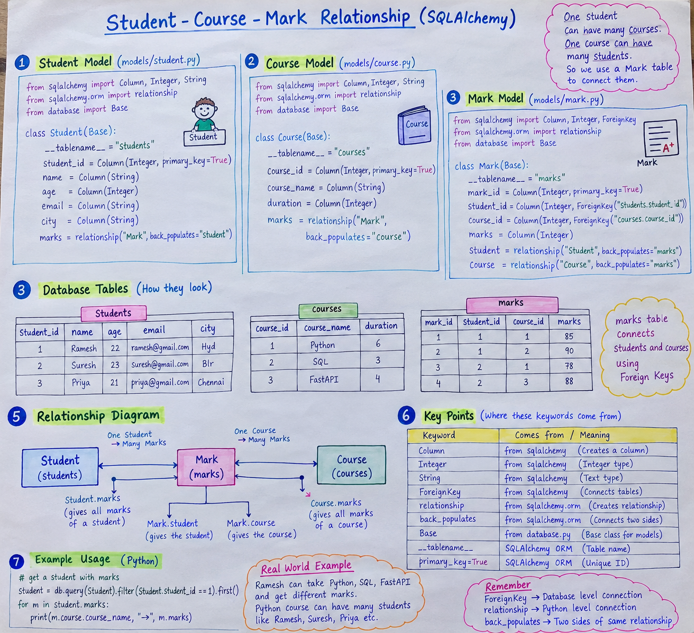

Absolutely 👍 I’ll make this in **GitHub README style**, but beginner-friendly. I’ll explain **where each keyword comes from, why we use it, and how the 3 models are related**.

# 🎓 Student–Course–Mark ORM Relationship

This example uses **SQLAlchemy ORM** to connect three database tables:

```text
Student
   │
   │ 1 → Many
   ↓
 Mark
   ↑
   │ Many → 1
   │
Course
```

### Real-world example

```text
Ramesh
   │
   ├── Python  → 85
   ├── SQL     → 90
   └── FastAPI → 88
```

Here:

* **Student** → student information
* **Course** → course information
* **Mark** → which student got how many marks in which course

---

# 📁 Project Structure

```text
project/
│
├── main.py
├── database.py
│
└── models/
    ├── __init__.py
    ├── student.py
    ├── course.py
    └── mark.py
```

---

# 1️⃣ First Understand Where Keywords Come From

Look at these imports:

```python
from sqlalchemy import Column, Integer, String, ForeignKey
from sqlalchemy.orm import relationship
from database import Base
```

These keywords don't come from our imagination. They come from **SQLAlchemy** or our own `database.py`.

| Keyword          | Comes from       | Purpose                              |
| ---------------- | ---------------- | ------------------------------------ |
| `Column`         | `sqlalchemy`     | Creates a database column            |
| `Integer`        | `sqlalchemy`     | Integer/number data type             |
| `String`         | `sqlalchemy`     | Text data type                       |
| `ForeignKey`     | `sqlalchemy`     | Connects tables                      |
| `relationship`   | `sqlalchemy.orm` | Creates Python-side relationship     |
| `Base`           | `database.py`    | Base class for ORM models            |
| `class`          | Python           | Creates a class                      |
| `__tablename__`  | SQLAlchemy ORM   | Specifies database table name        |
| `primary_key`    | SQLAlchemy       | Defines unique primary key           |
| `back_populates` | SQLAlchemy ORM   | Connects two relationship attributes |

---

# 2️⃣ `Base` ekkada nundi vachindi?

Our `database.py` usually contains:

```python
from sqlalchemy.orm import declarative_base

Base = declarative_base()
```

Then model files lo:

```python
from database import Base
```

So:

```text
database.py
     │
     └── Base
          ↓
      Student(Base)
      Course(Base)
      Mark(Base)
```

### Why?

`Base` tells SQLAlchemy:

> "These classes are ORM database models."

---

# 3️⃣ Student ORM Model

```python
from sqlalchemy import Column, Integer, String
from sqlalchemy.orm import relationship

from database import Base


class Student(Base):

    __tablename__ = "students"

    student_id = Column(
        Integer,
        primary_key=True
    )

    name = Column(String)

    age = Column(Integer)

    email = Column(String)

    city = Column(String)

    marks = relationship(
        "Mark",
        back_populates="student"
    )
```

Let's understand each part.

---

## 🔹 `class Student(Base)`

```python
class Student(Base):
```

`class` is a **Python keyword**.

`Student` is our class name.

`Base` is SQLAlchemy's ORM base.

Therefore:

```text
Student class
      ↓
SQLAlchemy ORM
      ↓
students table
```

---

# 4️⃣ `__tablename__`

```python
__tablename__ = "students"
```

This tells SQLAlchemy:

> Database table name is `students`.

So:

```text
Python                    Database

Student      ─────────→   students
```

---

# 5️⃣ `Column`

```python
student_id = Column(Integer, primary_key=True)
```

`Column` comes from:

```python
from sqlalchemy import Column
```

It represents a **database table column**.

For example:

```python
name = Column(String)
```

means:

```text
students table

name
----
Ramesh
Ravi
Suresh
```

---

# 6️⃣ `Integer`

```python
age = Column(Integer)
```

`Integer` comes from:

```python
from sqlalchemy import Integer
```

It tells SQLAlchemy:

> This column stores integer values.

Example:

```text
age
---
25
30
22
```

---

# 7️⃣ `String`

```python
name = Column(String)
email = Column(String)
city = Column(String)
```

`String` comes from:

```python
from sqlalchemy import String
```

It is used for text.

Example:

```text
name
----
Ramesh

email
-----
ramesh@gmail.com

city
----
Hyderabad
```

---

# 8️⃣ `primary_key=True`

```python
student_id = Column(
    Integer,
    primary_key=True
)
```

`primary_key` tells SQLAlchemy:

> This column is the unique identifier for each student.

Example:

```text
student_id | name
-----------|--------
1          | Ramesh
2          | Ravi
3          | Suresh
```

Every student has a unique `student_id`.

---

# 9️⃣ ⭐ `relationship()`

Now we reach the important part.

```python
marks = relationship(
    "Mark",
    back_populates="student"
)
```

`relationship` comes from:

```python
from sqlalchemy.orm import relationship
```

It tells SQLAlchemy:

> Student model ki Mark model tho relationship undi.

---

# 🔟 Why `"Mark"`?

```python
relationship("Mark")
```

Our other model is:

```python
class Mark(Base):
```

So:

```text
"Mark"
  ↓
Mark class
```

It means:

> Student ki related Mark objects ni connect cheyyi.

---

# 1️⃣1️⃣ Why `marks`?

```python
marks = relationship(...)
```

`marks` is the **Python attribute name**.

It represents the collection of Mark records belonging to that Student.

Example:

```text
Ramesh
   │
   ├── Python → 85
   ├── SQL → 90
   └── FastAPI → 88
```

Python:

```python
student.marks
```

means:

> Ramesh ki sambandhinchina marks records.

⚠️ Important:

```python
marks = relationship(...)
```

is **not a database column** like:

```python
name = Column(String)
```

It is a SQLAlchemy **relationship attribute**.

---

# 1️⃣2️⃣ `back_populates="student"`

This is another important keyword.

Student model:

```python
marks = relationship(
    "Mark",
    back_populates="student"
)
```

Mark model:

```python
student = relationship(
    "Student",
    back_populates="marks"
)
```

These two are connected:

```text
Student
   │
   │ marks
   ↓
 Mark
   │
   │ student
   ↓
Student
```

So:

```python
student.marks
```

and

```python
mark.student
```

are two sides of the same relationship.

### Easy memory trick:

```text
Student side:
marks

Mark side:
student

Therefore:

Student.marks ↔ Mark.student
```

---

# 1️⃣3️⃣ Course ORM Model

```python
class Course(Base):

    __tablename__ = "courses"

    course_id = Column(
        Integer,
        primary_key=True
    )

    course_name = Column(String)

    duration = Column(Integer)

    marks = relationship(
        "Mark",
        back_populates="course"
    )
```

This is almost the same as Student.

Database table:

```text
courses
--------------------------------
course_id | course_name | duration
--------------------------------
1         | Python      | 6
2         | SQL         | 3
3         | FastAPI     | 4
```

---

# 1️⃣4️⃣ Course `marks` relationship

```python
marks = relationship(
    "Mark",
    back_populates="course"
)
```

Meaning:

> One Course ki multiple Mark records undachu.

For example:

```text
Python
  │
  ├── Ramesh → 85
  ├── Ravi   → 90
  └── Suresh → 78
```

Python:

```python
course.marks
```

means:

> Ee course ki sambandhinchina Mark records.

And:

```text
Course.marks ↔ Mark.course
```

---

# 1️⃣5️⃣ Mark Model ⭐⭐⭐

The Mark table is the **connecting table**.

```python
class Mark(Base):

    __tablename__ = "marks"
```

Database table:

```text
marks
```

This table stores:

```text
Which student?
Which course?
How many marks?
```

---

# 1️⃣6️⃣ `mark_id`

```python
mark_id = Column(
    Integer,
    primary_key=True
)
```

Every mark record has a unique ID.

```text
mark_id
-------
1
2
3
4
```

---

# 1️⃣7️⃣ ⭐ `ForeignKey`

Now the most important keyword:

```python
from sqlalchemy import ForeignKey
```

We use:

```python
student_id = Column(
    Integer,
    ForeignKey("students.student_id")
)
```

`ForeignKey` means:

> One table's column refers to another table's primary key.

---

# 1️⃣8️⃣ `"students.student_id"` ekkada nundi vachindi?

Student model chudandi:

```python
class Student(Base):

    __tablename__ = "students"

    student_id = Column(
        Integer,
        primary_key=True
    )
```

We have:

```text
__tablename__ = "students"
```

and:

```text
student_id
```

Therefore:

```text
students.student_id
```

means:

```text
table name . column name
     ↓            ↓
 students    student_id
```

So:

```python
ForeignKey("students.student_id")
```

means:

```text
marks.student_id
       ↓
students.student_id
```

---

# 1️⃣9️⃣ Course ForeignKey

Same concept:

```python
course_id = Column(
    Integer,
    ForeignKey("courses.course_id")
)
```

Where did `"courses.course_id"` come from?

Course model:

```python
__tablename__ = "courses"

course_id = Column(
    Integer,
    primary_key=True
)
```

Therefore:

```text
courses.course_id
```

means:

```text
table name . column name
     ↓            ↓
 courses     course_id
```

So:

```text
marks.course_id
       ↓
courses.course_id
```

---

# 2️⃣0️⃣ Mark table complete

After understanding the above:

```python
class Mark(Base):

    __tablename__ = "marks"

    mark_id = Column(
        Integer,
        primary_key=True
    )

    student_id = Column(
        Integer,
        ForeignKey("students.student_id")
    )

    course_id = Column(
        Integer,
        ForeignKey("courses.course_id")
    )

    marks = Column(Integer)

    student = relationship(
        "Student",
        back_populates="marks"
    )

    course = relationship(
        "Course",
        back_populates="marks"
    )
```

Database-wise:

```text
marks
------------------------------------------------
mark_id | student_id | course_id | marks
------------------------------------------------
1       | 1          | 1         | 85
2       | 1          | 2         | 90
3       | 2          | 1         | 78
4       | 2          | 3         | 88
```

---

# 2️⃣1️⃣ `student = relationship("Student")`

```python
student = relationship(
    "Student",
    back_populates="marks"
)
```

This allows:

```python
mark.student
```

Meaning:

> Ee mark ye student di?

Example:

```text
Mark
student_id = 1
marks = 85
       ↓
Student
student_id = 1
name = Ramesh
```

So:

```python
mark.student.name
```

could give:

```text
Ramesh
```

---

# 2️⃣2️⃣ `course = relationship("Course")`

```python
course = relationship(
    "Course",
    back_populates="marks"
)
```

This allows:

```python
mark.course
```

Meaning:

> Ee mark ye course ki sambandhinchindi?

Example:

```text
Mark
course_id = 1
marks = 85
       ↓
Course
course_id = 1
course_name = Python
```

So:

```python
mark.course.course_name
```

could give:

```text
Python
```

---

# 2️⃣3️⃣ Complete Relationship 🧠

This is the main thing you should remember:

```text
                  Student
                     │
                     │
            Student.marks
                     │
                     ↓
                   Mark
              ↙             ↘
     Mark.student          Mark.course
          ↙                   ↘
      Student                Course
```

Database relationship:

```text
students
   │
   │ student_id
   │
   ↓
marks
   │
   │ course_id
   ↓
courses
```

More clearly:

```text
students.student_id
        ↑
        │ ForeignKey
        │
marks.student_id


courses.course_id
        ↑
        │ ForeignKey
        │
marks.course_id
```

---

# 2️⃣4️⃣ Why do we need `ForeignKey` AND `relationship()`?

This is **very important for interviews**.

### `ForeignKey`

```python
ForeignKey("students.student_id")
```

handles the **database-level connection**.

```text
Database
students.student_id
        ↑
        │
marks.student_id
```

### `relationship()`

```python
relationship("Student")
```

handles the **Python/ORM-level object connection**.

```text
Python
mark.student
     ↓
Student object
```

Therefore:

```text
ForeignKey
    ↓
Database relationship

relationship()
    ↓
Python object relationship
```

---

# 2️⃣5️⃣ Why `back_populates`?

`back_populates` connects the two relationship attributes.

```python
# Student
marks = relationship(
    "Mark",
    back_populates="student"
)
```

and:

```python
# Mark
student = relationship(
    "Student",
    back_populates="marks"
)
```

So SQLAlchemy understands:

```text
Student.marks
      ↕
Mark.student
```

Similarly:

```text
Course.marks
      ↕
Mark.course
```

---

# 2️⃣6️⃣ One Student → Many Marks

Suppose:

```text
Student ID = 1
Name = Ramesh
```

Marks:

```text
mark_id | student_id | course_id | marks
--------|------------|-----------|------
1       | 1          | 1         | 85
2       | 1          | 2         | 90
3       | 1          | 3         | 88
```

Notice:

```text
student_id = 1
student_id = 1
student_id = 1
```

Multiple Mark records can belong to the same Student.

Therefore:

```text
One Student
     ↓
Many Marks
```

---

# 2️⃣7️⃣ One Course → Many Marks

Suppose Python course:

```text
course_id = 1
course_name = Python
```

Marks:

```text
mark_id | student_id | course_id | marks
--------|------------|-----------|------
1       | 1          | 1         | 85
3       | 2          | 1         | 78
5       | 3          | 1         | 92
```

Again:

```text
course_id = 1
course_id = 1
course_id = 1
```

Therefore:

```text
One Course
     ↓
Many Marks
```

---

# 2️⃣8️⃣ ⭐ Final Mental Model

Don't try to memorize the code directly. Remember this story:

```text
Student table
     │
     │ "Which student?"
     ↓
Mark table
     │
     │ "Which course?"
     ↓
Course table
```

Mark table answers:

```text
Who?        → student_id
Which?      → course_id
How much?   → marks
```

So:

```text
Student
  ↓
student_id
  ↓
Mark
  ↓
course_id
  ↓
Course
```

---

# 🧠 Keywords Cheat Sheet

| Keyword            | Simple meaning                                  |
| ------------------ | ----------------------------------------------- |
| `Base`             | ORM models ki base class                        |
| `class`            | Python class create cheyyadaniki                |
| `__tablename__`    | Database table name                             |
| `Column`           | Database column                                 |
| `Integer`          | Number type                                     |
| `String`           | Text type                                       |
| `primary_key=True` | Unique ID                                       |
| `ForeignKey()`     | Tables ni DB level lo connect chestundi         |
| `relationship()`   | Python objects ni connect chestundi             |
| `"Student"`        | Student ORM class                               |
| `"Mark"`           | Mark ORM class                                  |
| `"Course"`         | Course ORM class                                |
| `back_populates`   | Relationship opposite side ni connect chestundi |
| `student_id`       | Student ni identify chestundi                   |
| `course_id`        | Course ni identify chestundi                    |
| `marks`            | Actual marks value                              |

---

# 🎯 Interview lo Simple Answer

### Q: What is `ForeignKey`?

> `ForeignKey` is used to connect a column in one table with the primary key of another table.

Example:

```python
ForeignKey("students.student_id")
```

means `marks.student_id` refers to `students.student_id`.

### Q: What is `relationship()`?

> `relationship()` creates a Python-side relationship between SQLAlchemy ORM models.

### Q: What is `back_populates`?

> `back_populates` tells SQLAlchemy that two relationship attributes represent opposite sides of the same relationship.

Example:

```python
Student.marks
      ↕
Mark.student
```

### ⭐ One-line memory trick

```text
Column       → Database column
ForeignKey   → Database connection
relationship → Python connection
back_populates → Two Python sides connection
```

This is the core idea behind your **Student → Mark ← Course** ORM relationship.
----
----

----
----
